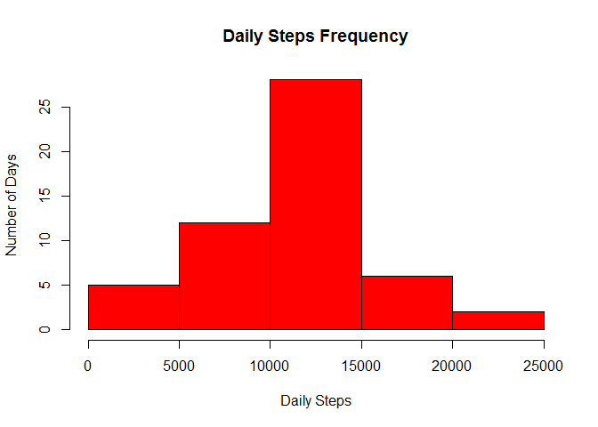
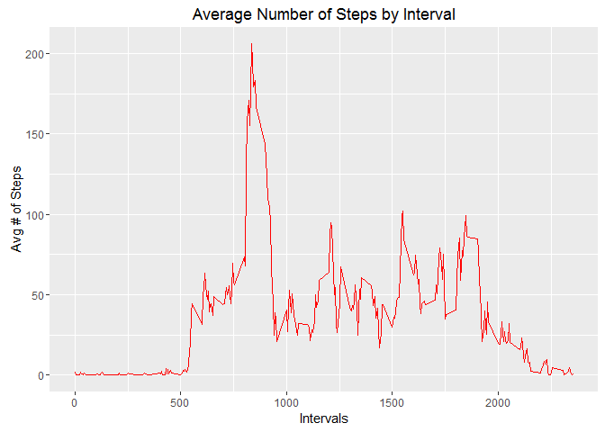
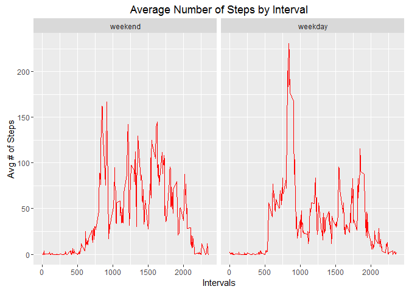

# Reproducible Research: Peer Assessment 1
#Summary
This document describes the procedures used to access, load and manipulate data from a personal activity monitoring device. This device collects data at 5 minute intervals through out the day. The data consists of two months of data from an anonymous individual collected during the months of October and November, 2012 and include the number of steps taken in 5 minute intervals each day.

#Study Design
The dataset consists of 17658 observations of 3 variables (steps, date, interval). The data was forked and cloned from an instructor github site. All the script steps were in response to specific requirements levied for the assignment.

* Data File: activity.csv
* Date Downloaded: 11 April 2016

#Required Libraries:
* ggplot2

## Loading and preprocessing the data
The data was loaded from the user's R working directory which is separate from the github directory. The dates were converted to date class and the final data frame "activityDataRaw" serves as the base data for all subsequent operations.

```r
## Unzip and Load the activity data
unzip("C://Program Files/Git/Projects/DataScientistsToolbox/RepData_PeerAssessment1/activity.zip")
activityDataRaw <- read.csv("activity.csv", stringsAsFactors = FALSE)

## Ensure date variable is data class
activityDataRaw$date <- as.Date(activityDataRaw$date)
```

## What is mean total number of steps taken per day?
The data was aggregated by date and the number of steps for each day were summed. In order to maintain data integrity, and due to some uncertainty regarding about "ignoring" NA values, an na.action = NULL was included to ensure that all 61 days of activity were retained. This has a minor effect on the step frequency histogram. It had a larger effect on calculating the mean and median values (10766.19 and 10765, respectively). If the decision had been made to remove days (53 days without NA values), then both the mean and median would have been significantly lower.


```r
## Aggregate by date and sum step counts.
dailySteps <- aggregate(steps ~ date, data = activityDataRaw, sum, na.action = NULL)

## Plot histogram of frequency of daily step count.
hist(dailySteps$steps, xlab = "Daily Steps", ylab = "Number of Days", main = "Daily Steps Frequency", col = "red")
```



```r
## Calculate and store mean/median of data. Does not count days with NA.
avgDailySteps <- mean(dailySteps$steps, na.rm = TRUE)
medDailySteps <- as.numeric(median(dailySteps$steps, na.rm = TRUE))

## Output results
avgDailySteps
```

```
## [1] 10766.19
```

```r
medDailySteps
```

```
## [1] 10765
```

## What is the average daily activity pattern?
The data was aggregated by interval and the number of steps per interval were then averaged. The data was then plotted as a line graph. Interval 835 had the highest mean step count of 206.17.


```r
## Calculate mean steps per 5 minute interval for all days
intervalSteps <- aggregate(steps ~ interval, data = activityDataRaw, mean)

## Load ggplot2. Plot mean steps per day. Output to PNG.
library(ggplot2)
plotInterval <- ggplot(intervalSteps, aes(intervalSteps$interval, intervalSteps$steps))
plotInterval + geom_line(col = "red") + 
    labs(x = "Intervals", y = "Avg # of Steps", title = "Average Number of Steps by Interval")
```



```r
## Calculate and store interval with maximum avg number of steps
maxIntervalSteps <- intervalSteps[intervalSteps$steps == max(intervalSteps$steps),]

## Output result
maxIntervalSteps
```

```
##     interval    steps
## 104      835 206.1698
```

## Imputing missing values
First the number of NA values was calculated and found to be 2304. A separate data frame (imputedActivityData) was created from the base data frame and bound to the intervalSteps data frame created to answer the previous question. The additional column names were then changed to remove any chance of variable conflict. The ifelse function was used to impute the mean interval value for a given NA interval, so if interval 100 had a mean value of 1.5, then all NA interval 100's were imputed with 1.5. A final check was performed to ensure all NA values had been imputed.


```r
## Calculate number of rows with NA values
naCheck <- is.na(activityDataRaw$steps)
sum(naCheck)
```

```
## [1] 2304
```

```r
## Impute missing values. 
## Create separate table, bind previous interval step data frame, and rename bound columns
imputedActivityData <- activityDataRaw
imputedActivityData <- cbind(activityDataRaw,intervalSteps)
names(imputedActivityData) <- c("steps", "date", "interval", "imputeInt", "imputeSteps")

## Impute values with transform and ifelse function, replacing NA with imputeSteps value
imputedActivityData = transform(imputedActivityData, steps = ifelse(is.na(steps), imputeSteps, steps))

## Validate NA values have been imputed
naImputeCheck <- is.na(imputedActivityData$steps)
sum(naImputeCheck)
```

```
## [1] 0
```

## Are there differences in activity patterns between weekdays and weekends?
The data was aggregrated by date and steps per day were summed. The resulting histogram showed a distinct increase in overall frequency counts.


```r
## Aggregate imputed data frame by date and sum step counts.
dailyStepsImputed <- aggregate(steps ~ date, data = imputedActivityData, sum)

## Plot histogram of frequency of daily step count.
hist(dailyStepsImputed$steps, xlab = "Daily Steps", ylab = "Number of Days", main = "Daily Steps Frequency", col = "red")
```


Average and median steps were calculated and found to be very similar to the original findings for 2 likely reasons. First, the fact that NA values were not removed in the first run, and second because the imputation method chosen ensured that previously zero count days now had significant step counts. In fact, both the mean and median were found to be 10766.19, identical to the mean from the first run. Different decisions would have provided different results.

```r
## Calculate and store mean/median of imputed data
avgDailyStepsImputed <- mean(dailyStepsImputed$steps)
medDailyStepsImputed <- as.numeric(median(dailyStepsImputed$steps))

## Output results
avgDailyStepsImputed
```

```
## [1] 10766.19
```

```r
medDailyStepsImputed
```

```
## [1] 10766.19
```

To determine average interval step count differences between weekend and weekdays, another variable (wkday) was added and populated. This variable was subsequently converted to a factor variable. The results were then plotted using ggplot and showed visibly more activity during the week than on weekends.


```r
## Add weekday variable to imputed data frame
imputedActivityData$wkday <- weekdays(imputedActivityData$date)

## Create character vector to use for setting up weekday/weekend factors
weekdays1 <- c('Monday', 'Tuesday', 'Wednesday', 'Thursday', 'Friday')

## Create factor levels and then aggregate complete, imputed data into new data frame.
imputedActivityData$wkday <- factor(imputedActivityData$wkday %in% weekdays1, levels=c(FALSE, TRUE), labels=c('weekend', 'weekday'))
intervalImputedSteps <- aggregate(steps ~ wkday + interval, data = imputedActivityData, mean)

## Plot weekday and weekend interval averages

plotInterval <- ggplot(intervalImputedSteps, aes(interval, steps))
plotInterval + geom_line(col = "red") + 
    facet_grid(. ~ wkday) +
    labs(x = "Intervals", y = "Avg # of Steps", title = "Average Number of Steps by Interval")
```



```r
## End of script
```
